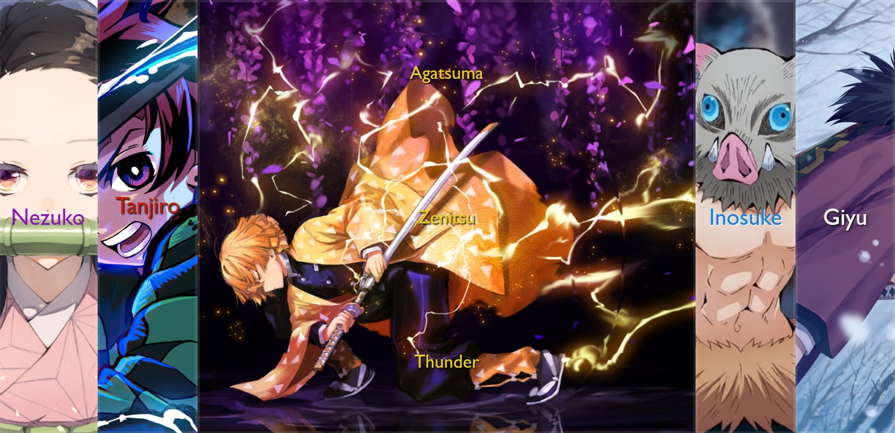

# 🖼️ JavaScript - Anime Image Gallery



Welcome to the Anime Image Gallery! This project aim was to build a fully operative image gallery just by using **HTML, CSS (Sass) and JavaScript**.

## 🌐 Link to the App.

Should you wish to take a look to the deployed app, [feel free to visit the link here](https://yarapaz.github.io/image-gallery/)

## 🗂️ Content

1. [Project Structure](#-project-structure)
2. [Process](#️-process)
   1. [Front-end](#-front-end)
3. [How to run the Apps](#-how-to-run-the-apps)
   1. [Pre-requeriments](#pre-requeriments)
4. [Author](#-author)

---

## 🧱 Project structure

```
/
|
|     |– index.html
|     |– images
|     |– javascript
|     |– stylesheets
```

## ⚒️ Process

### ⭐ Front-end

---

```
/
|
|     |– index.html
|     |– images
|     |– javaScript
|     |– stylesheets
|       |-main.css
```

### ✳️ SASS

I have used SASS to organise the project styles in a clear and concise way.

## 🚀 How to run the Apps.

### Pre-requeriments

To start using this project clone this repo to a new directory.

> ```console
>  $ git clone https://github.com/yarapaz/image-gallery.git
> ```

### ➡️ Node

---

You have to go to the repositories folder and run npm install in order to install the necesary dependencies.

> ```console
> $ cd image-gallery
> $ npm install
> ```

Once you have installed the dependencies, you are ready to run the app with `npm start`.

> ```console
> $ npm start
> ```

> 👉 Open http://localhost:3000 to view the app in the browser

Once inside you will see the image gallery. By clicking on the different pictures you will be able to see the image grow to see it better and more information about it popping up from top and bottom.

And that's all! Enjoy and have fun!

## 👩‍💻 Author

This App has been developed by [**Yara Paz**](https://github.com/yarapaz).
